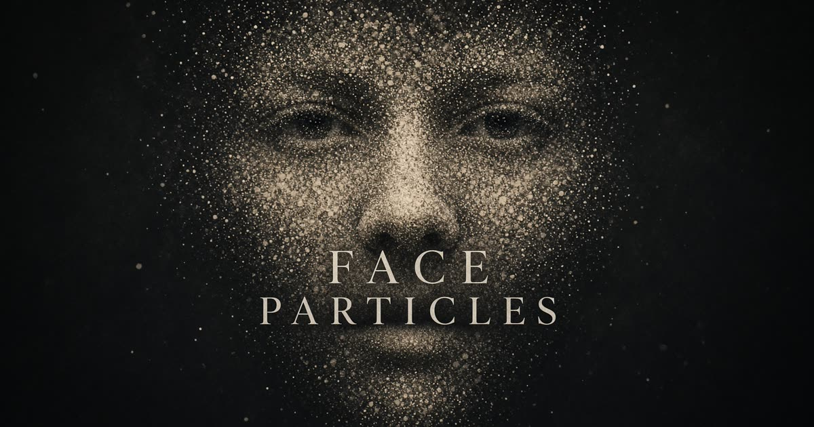

# Face Particles 3D

Transform any face portrait into an interactive, photorealistic 3D particle sculpture powered by on-device computer vision and WebGL2 GPU transform feedback physics.



## Features

- **On-Device Face Vision**: Runs MediaPipe FaceLandmarker and Multiclass ImageSegmenter directly in the browser via WebGL and WebAssembly — **100% private, no images leave your device**.
- **Interactive 3D Particle Cloud**: 25,000 to 100,000+ particles simulated via WebGL2 Transform Feedback with GPU curl noise, spring-damper dynamics, orbital rotation, and multi-touch/mouse fluid interactions.
- **Particle Color Palettes**:
  - **Mono (B&W)**: Classic silver luminous particle sculpture.
  - **Hybrid (Color + B&W)**: Simultaneously renders photorealistic RGB colors sampled directly from the face interwoven with glowing monochrome stardust particles, with an adjustable ratio slider.
  - **Full Color**: Vibrant, true-to-life colors extracted from the original portrait.
- **Cinematic Effects**:
  - **Assemble**: Snaps scattered particles into the sculpted 3D face.
  - **Break / Disassemble**: Explodes the portrait into a swirling particle mist.
  - **Wind**: Dynamic lateral breeze sweeping across the face mesh.
  - **Vortex**: Spiral vortex warping the facial structure.
  - **Ripple**: Radial shockwave pulsating through the particle field.
- **Full Customization**: Fine-tune particle count, size, contrast, facial feature weighting, shadow lift, depth curvature, silhouette softness, and color inversion.
- **Export**: Instant high-res still snapshot (`PNG`) and timeline animation recording (`MP4`/`WebM`).

---

## Tech Stack

- **Framework**: TanStack Start / React 19 / Nitro
- **Styling**: Tailwind CSS v4
- **Graphics & Physics**: WebGL2 Transform Feedback, Custom GLSL Shaders
- **Machine Learning**: `@mediapipe/tasks-vision` (FaceLandmarker + Multiclass Segmenter)
- **Deployment**: Optimized for Vercel

---

## Getting Started

### Prerequisites

- Node.js 20+ (Node 22 recommended)
- npm

### Installation

```bash
# Clone the repository
git clone https://github.com/abhiraj444/face-particles-3d.git
cd face-particles-3d

# Install dependencies
npm install

# Start development server
npm run dev
```

Open [http://localhost:8080](http://localhost:8080) in your browser.

---

## Deploy to Vercel

1. Push your repository to GitHub.
2. Go to [Vercel Dashboard](https://vercel.com/new).
3. Select **Import Project** and choose `face-particles-3d`.
4. Leave the default settings (Framework: Other / Vite; Build Command: `npm run build`; Output Directory: `.vercel/output`).
5. Click **Deploy**!

---

## License

MIT
